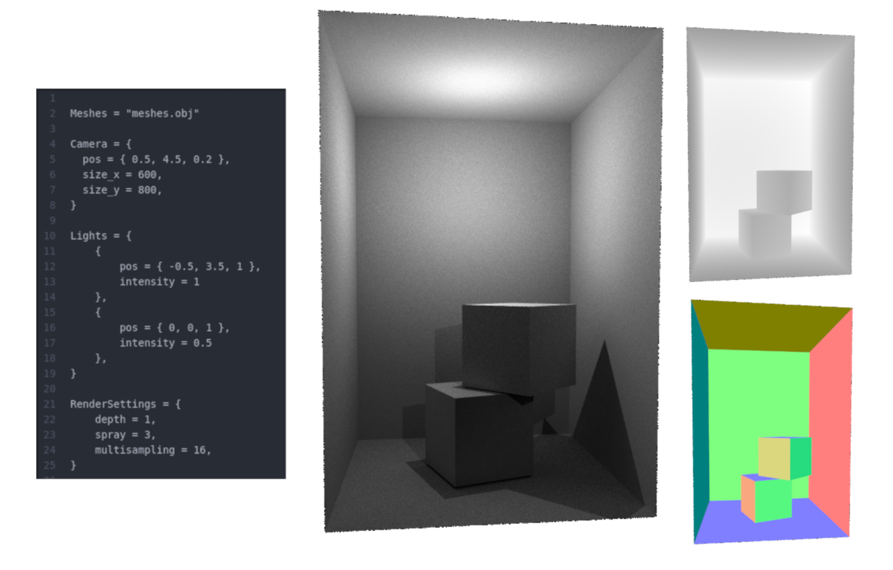
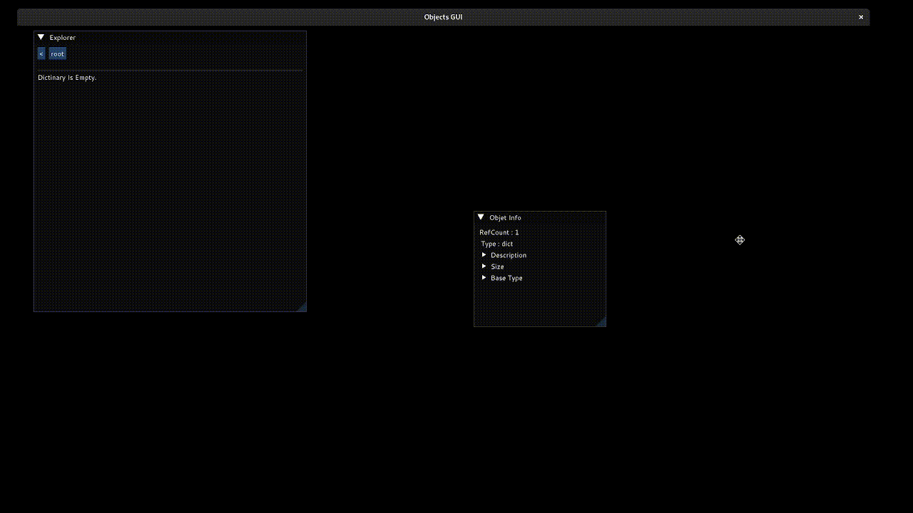
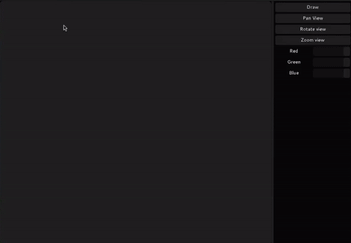

# **Modules**

This repository started as a place for learning C++.
Many modules were intentionally developed to gain a better understanding of a topic as opposed to using libraries. As time passes some modules gradually vanish due to my new experience and knowledge, and some grow.
Currently, some of the most interesting ones:

* **Containers** - a collection of implementations of well-known containers: Lists, Hash-Map, Trees, Interval Tree.
* **Math** -  Features some aspects of linear algebra (Matrix operations, vectors). For example, used by the RayTracer and Sketch3D module.
* **RayTracer** -  simple ray-tracer with object loader and lua configuration.
* **Objects** (Python inspired) - encapsulates different types into Python-like objects. The module has its scripting language "Oscript" with support for methods, classes, pure functions, loops, conditions, etc. It uses compilation to bytecode and LALR parser. All objects can be saved and loaded at any time, whether it's a list or a method with bytecode. Some parts of this module have bad implementations and unstable code. Also, the module suffers from a lack of good testing.
* **Sketch3D** - application with the ability to draw in 3D space. Features stroke processing and view-dependent shaders. Has lots of TODOs.
* **Data analysis** - simple fully connected neural network (FCNN). Contains example application that is recognizing hand written numbers.

For more information on some modules see TODO and STATUS

# **Building**

On Linux with clang with some libraries installed. See workflow in git actions.

To build and debug on windows clone svn repository (https://svn.riouxsvn.com/moduleswindowsl) alongside this repo and check WINDOWS_LIBRARIES option in cmake

# **Gallery**

Simple Ray-Tracer.

Oscript.

Sketch3D.
